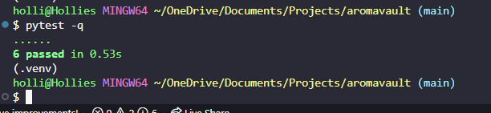

# AromaVault

AromaVault is a simple command-line app made to help people manage and explore different perfumes.  
You can add perfumes, see them listed, search by name or brand, and even get recommendations based on what you like.  


[View the live Heroku app here](https://aromavault.herokuapp.com)   XXXX

---

## Table of contents

### [User Experience (UX)](#user-experience-ux)
* [User Stories](#user-stories)
### [Features](#features)
* [Current Features](#current-features)
* [Future Features](#future-features)
### [Design](#design)
### [Technologies Used](#technologies-used)
### [Frameworks, Libraries & Programs Used](#frameworks-libraries--programs-used)
### [Testing](#testing)
* [Automated Testing](#automated-testing)
* [Manual Testing](#manual-testing)
* [Testing Results](#testing-results)
* [Validation](#validation)
### [Deployment and Local Development](#deployment-and-local-development)
* [Heroku Deployment](#heroku-deployment)
* [Forking the Repository](#forking-the-repository)
* [Cloning Locally](#cloning-locally)
### [Credits](#credits)
### [Acknowledgements](#acknowledgements)
### [Learning Outcomes Alignment](#learning-outcomes-alignment)

---

## User Experience (UX)

AromaVault was made to be simple, useful, and clear for anyone who likes perfumes or just wants to manage a collection.  
It shows clear messages and tables in colour, using the Rich library, to make the command-line more friendly.

---

### User Stories

**First**-time users
- Want to know what the app does and how to use it.
- Want to add a perfume easily.
- Want to search perfumes by name or brand.

**Returning users**
- Want to update or remove perfumes.
- Want to save their scent preferences.
- Want recommendations based on their profile.

**Admin or tester**
- Want to import and export perfume data.
- Want to check that the app runs and works fine on Heroku.

---

## Features

### Current Features

* **Add a perfume**

  - Add name, brand, price, and scent notes.
  ```bash
  python app.py add-perf "Rose Dusk" --brand "Floral" --price 55 --notes rose,musk


**List perfumes**


See all perfumes in a nice table.
python app.py list-perfumes-cmd


**Find perfumes**
Search perfumes quickly with fuzzy matching.
python app.py find "rose"


**Update or remove perfumes**


Change perfume details or delete by ID.
python app.py update 4d9ac909 price 59
python app.py remove 4d9ac909


Add user profiles
Save what scents someone likes or dislikes.
python app.py add-profile-cmd "Hollie" --preferred rose,musk --avoid linalool
Get recommendations
Suggests perfumes based on a user’s saved profile.
python app.py recommend-cmd --profile <PROFILE_ID>

Export and import
Save all perfumes to a CSV or import from one.


python app.py export-csv-cmd perfumes.csv

Seed data
Quickly add three demo perfumes for testing.

python app.py seed-minimal


Future Features
Add a user rating system.

Let users sort by price range or scent family.

Add small dashboard showing totals and averages.

Allow multiple users to store their own data.

Design
The app keeps a clean look in the terminal with colour and layout from the Rich library.
It uses simple data storage in JSON so it’s quick and easy to work with.
The code is split into parts for clarity:

app.py – main CLI file

models.py – perfume and user profile data

storage.py – save, load, and update data

utils.py – helper functions

Technologies Used
Python 3

Typer

Rich

RapidFuzz

Pytest

Ruff

Frameworks, Libraries & Programs Used
GitHub – version control

Heroku – deployment

Visual Studio Code – IDE

Rich – for colourful output

Typer – for easy CLI commands

RapidFuzz – for fuzzy search

Testing
Automated Testing


Test file	What it checks	Result
tests/test_models.py	Perfume and profile creation	✅ Passed
tests/test_storage.py	Save, read, and delete functions	✅ Passed
tests/test_cli.py	CLI commands like add, list, find	✅ Passed
tests/test_utils.py	Helper functions	✅ Passed

All tests passed locally and on GitHub Actions.

Manual Testing
What was tested	Command	Expected outcome	Result
Add perfume	python app.py add-perf "Rose Dusk" --brand "Floral" --price 55 --notes rose,musk	Shows confirmation message	✅
List perfumes	python app.py list-perfumes-cmd	Displays all perfumes	✅
Search perfumes	python app.py find "rose"	Finds “Rose Dusk”	✅
Update perfume	python app.py update 4d9ac909 price 59	Confirms update	✅
Remove perfume	python app.py remove 4d9ac909	Confirms delete	✅
Export data	python app.py export-csv-cmd data.csv	Saves CSV file	✅
Import data	python app.py import-csv-cmd data.csv	Imports file	✅
Add profile	python app.py add-profile-cmd "Hollie" --preferred rose,musk --avoid linalool	Creates profile	✅
Recommend	python app.py recommend-cmd --profile <PROFILE_ID>	Shows recommendations	✅

Testing Results
<details> <summary>✅ Seed Minimal Test</summary>

</details> <details> <summary>✅ List Perfumes Output</summary>

</details> <details> <summary>✅ Search Result Example</summary>

</details> <details> <summary>✅ Recommendations Output</summary>

</details>
Validation
Code Style: Checked with Ruff – no major issues found.


Testing: pytest used to confirm all functions work correctly.

Deployment: Tested successfully on Heroku with heroku run bash.

Error Handling: All commands handle wrong inputs clearly with helpful messages.


Open the terminal:

heroku run bash -a aromavault
python app.py --help
Forking the Repository
Go to the GitHub repo AromaVault.

Click Fork in the top right corner.

This makes a copy under your own account.

Cloning Locally
On GitHub, click the green Code button.

Copy the HTTPS link.

In your terminal:


git clone https://github.com/HollieMorrison/aromavault.git
Create and activate a virtual environment:

Media
Screenshots created by Hollie Morrison.

Acknowledgements
Thanks to my mentor for feedback and advice.

The Code Institute Slack community for answering questions and helping me fix issues.

Friends and family for testing the app and giving honest feedback.